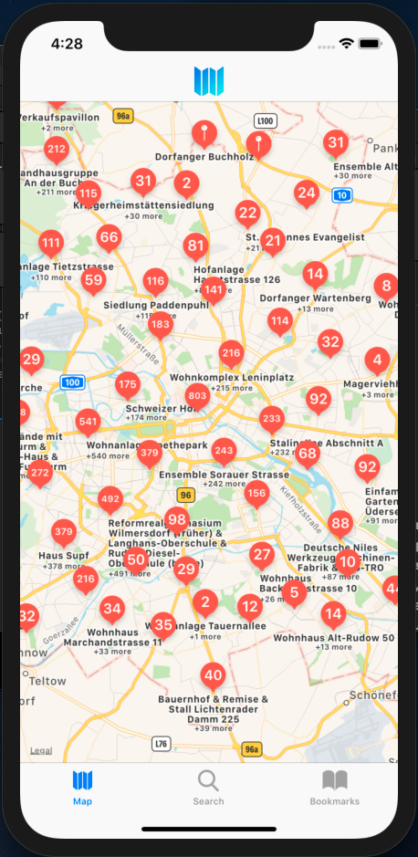
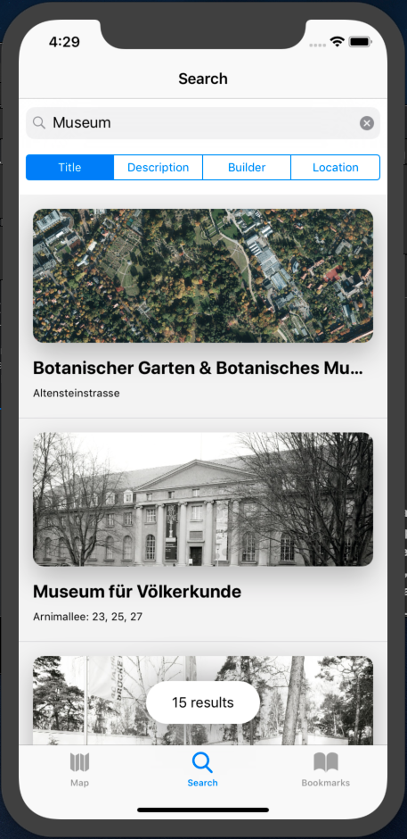
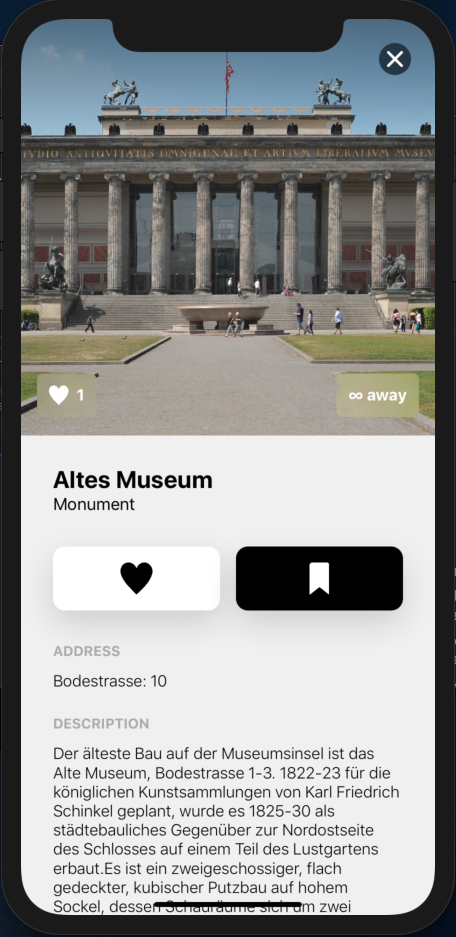
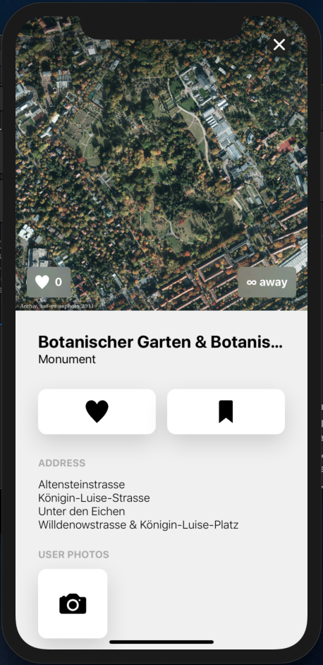

# AISights

## AI Component
The app has embedded neural network (image classifier) which allows only uploading of the appropriate images of the memorials in Berlin. Selfie pictures and other photos will be rejected.

## Architecture
MVVM with 3 layers (presentation, domain and data)  
Server database - firebase realtime database  
Local database - realm

## Functionality
Map with memorials  
Directions to the memorial  
Search  
Bookmark  
Like  
You can show memorials by voice command (Siri shortcut)

## Screenshots
  
  
  
  
  

## Video
[Commercial-like video that was done by one of the team members](https://drive.google.com/file/d/18roVulxg_mbYrNvtO9K6zZxyW0IA0VNp/view?usp=drivesdk)
